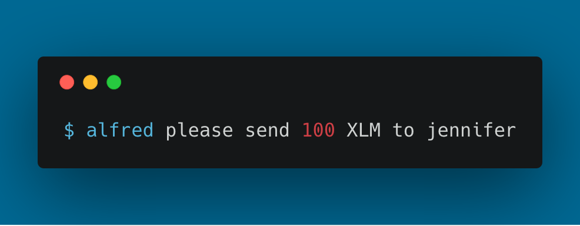
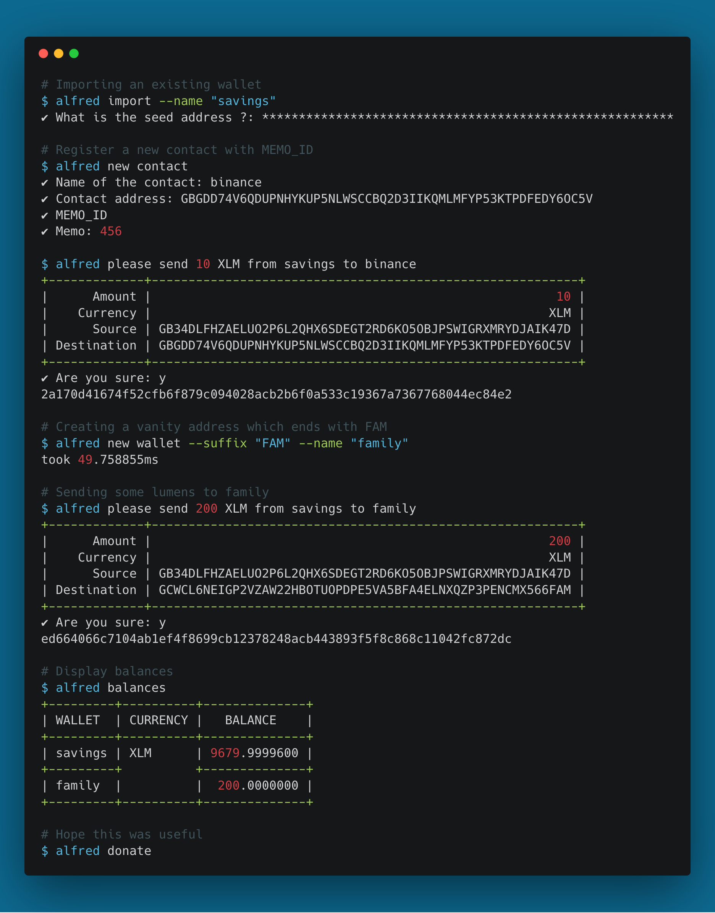

<h1 align="center">Alfred</h1>
<p align="center">
  
  <br />
  A user friendly Stellar wallets manager.
</p>

<p align="center">
    <a href="https://github.com/celrenheit/alfred/releases/latest"></a>
    <a href="https://travis-ci.org/celrenheit/alfred"></a>
    <a href="LICENSE"> </a>
</p>

<!-- START doctoc generated TOC please keep comment here to allow auto update -->
<!-- DON'T EDIT THIS SECTION, INSTEAD RE-RUN doctoc TO UPDATE -->
**Table of Contents**

- [Feature](#feature)
- [Install](#install)
- [Usage](#usage)
  - [Typical workflow](#typical-workflow)
  - [Importing a wallet](#importing-a-wallet)
  - [Creating a random wallet](#creating-a-random-wallet)
    - [Creating a vanity address](#creating-a-vanity-address)
  - [Show balances:](#show-balances)
  - [Sending lumens](#sending-lumens)
  - [Adding contacts](#adding-contacts)
- [Disclaimer](#disclaimer)
- [Donate](#donate)

<!-- END doctoc generated TOC please keep comment here to allow auto update -->

# Feature

- Single human readable yaml file
- AES encryption for seeds
- Contacts/aliases
- (very) easy to use
- Create shared accounts 
  - 1 master in full control (dictator) with multiple possible payers (having medium access)
- Set Data using manage_data

# Install 

- MacOS: `brew install celrenheit/taps/alfred`
- Windows/Linux: https://github.com/celrenheit/alfred/releases
- From Source: `go get -u github.com/celrenheit/alfred`

# Usage


## Typical workflow

<p align="center">
  
</p>


## Importing a wallet
```shell
alfred import 
```
Optionaly, you can name your wallet using `alfred import --name "my awesome wallet"`

## Creating a random wallet
```shell
alfred new
```

### Creating a vanity address

```shell
alfred new --suffix "HUG"
```
Optionaly, you can name your wallet using `alfred new --name "my awesome wallet"`

## Show balances:
```shell
alfred balances
```

Output:
```
+----------------------------------------------------------+----------+-----------+
|                          WALLET                          | CURRENCY |  BALANCE  |
+----------------------------------------------------------+----------+-----------+
| GCXXY622NRUFSBIA5Z3MVYKOXKZYGPC5Z6VCPVQ2JUPYSNHQJNXC3P7Z | XLM      | 2.9999700 |
+----------------------------------------------------------+----------+-----------+
```

## Sending lumens

```shell
alfred send 10 XLM from master to jennifer
```

## Adding contacts

```shell
alfred new contact
```


## Sharing an account

```shell
alfred please share account savings with alice, bob and celine
```

## Setting data

In this example, it will set data key-value pairs for the selected account:

```shell
alfred please set data mykey1 = myvalue1, mykey2 = myvalue2 
```

It possible to setup the contents of a file (using `from` keyword) as the value of a key:

```shell
alfred please set data mykey1 from ./text.txt
```

**NOTE**: If you want your keys or values to have spaces or special characters, you have to use quotes (`"`or `'`) around the whole query and the key/value:

```shell
alfred please 'set data "my key 1" = "my value 1", "my key 2" from "./text space.txt"' 
```

# Disclaimer

USE AT YOUR OWN RISK.
Always keep your secret seeds in a safe place (for example, a paper wallet).

# Donate


If you which to donate, use the command below:
```shell
alfred donate
```

... or the following address:

**XLM**: GCDMBL2SDMM74I2EOM5XHF7LMMDXFEJQIZ5N2ORK6HBSHM5INLALFRED